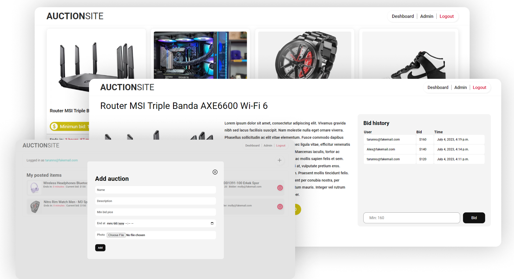

# Assessment
### Video link: https://drive.google.com/file/d/13ehJzBJGv7POZcziZmqg_y082ySo25dv/view?usp=sharing

# Previews

# Challenges 
Stap-1:
- for email based authentication I had to overwirte the default user model using AbstractBaseUser the proccess involves BaseUserManager.

Step-2:
- for providing correct timezone for a acution I had to change the TIME_ZONE = 'Asia/Dhaka'.
- I had to use Pillow to resize the image of it has width or height greater than 800 which reduces the space taken by media files.
- django cleanup is used to clearup files that are not in use else unnecessary file took way to much space.

Step 3:
- count down needed to be calculated perfectly to end a acution which can be displayed using timeuntil template tag.

Step 4:
- ending a auction functionality by using proper localtime as django by default uses TIME_ZONE = 'UTC' which is 6 hours ahead of BD time

Step 5:
- for showing charts I have use Chart Js library and integrated it with django
- calculated the change of auction added and auction completed from threads and display them in a chart, acution value in another one.
  
Step 6:
- CSS refectoring

# Packages
- Django: most of the work I have done using utils libraries of django.
- Django cleanup: django cleanup is used to clearup files that are not in use else unnecessary file took way to much space.
- Pillow: Pillow to resize the image of it has width or height greater than 800 which reduces the space taken by media files.
- Chart Js: JavaScript library of charts.